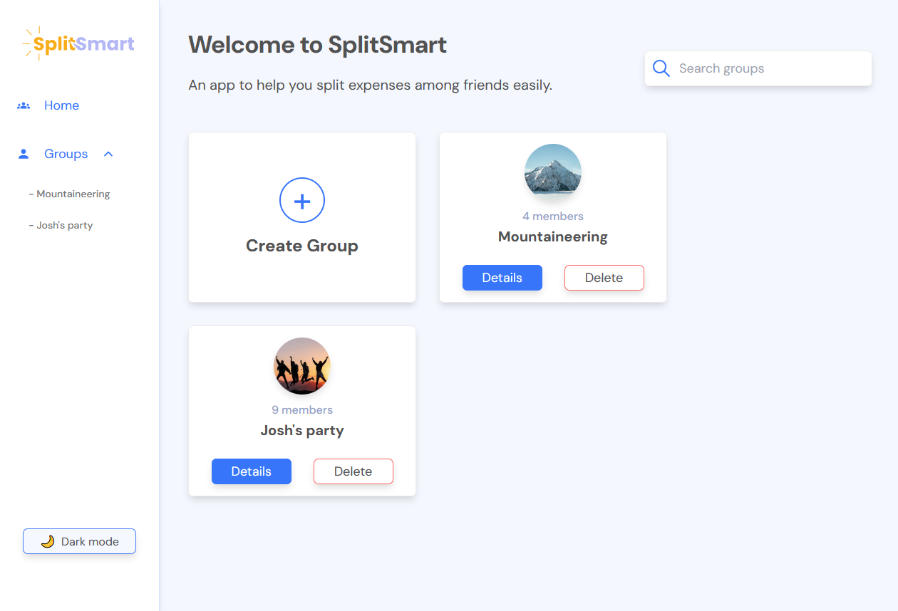
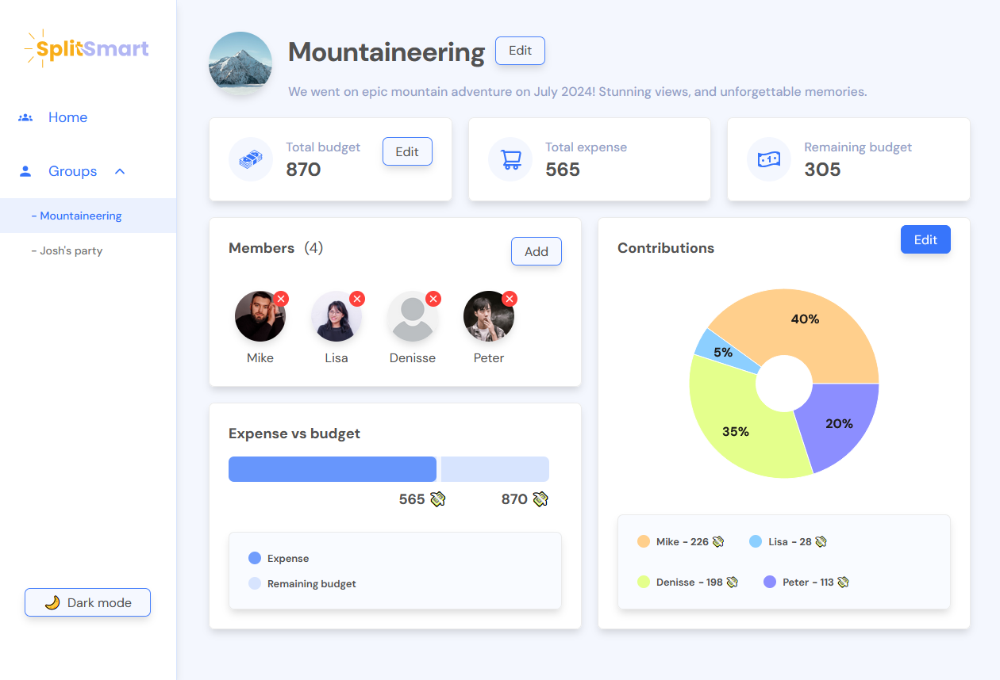

# Split Wise

# 🔗 [Live preview](https://splitwisewebsite.netlify.app/)

# ▶️ [Video walkthrough by dev](https://youtu.be/d6Xhf7XYMes)

---

## Table of Contents

- [About Project](#about-project)
- [Features](#features)
- [How it works](#how-it-works)
- [Technologies & Dependencies used](#technologies--dependencies-used)
- [Prerequisites](#prerequisites)
- [Clone & Run locally](#clone--run-locally)
- [Team](#team)
- [Special Thanks](#special-thanks)
- [Contributing](#contributing)

---

## About Project

Split Wise is an application designed to simplify splitting expenses among friends, family, or colleagues. Whether you're planning a trip, organizing a group dinner, or managing shared expenses, Split Wise helps you keep track of who owes what and ensures that everyone pays their fair share.

Split Wise was built using React + Vite. It is only a front-end app, so it doesn't have a database or a backend. For more technical details for developers, see section _Technologies & Dependencies used_. The app was built by a team of 6, during a 6 week time period, see more in the section _Team_

---

## Features

- **Create and Manage Groups:** Create groups for different events or activities and manage them from a single dashboard.
- **Add and Remove Members:** Add members to your groups and remove them if no longer part of a group.
- **Track Expenses:** Keep track of all expenses within a group.
- **Equal Contributions:** By default, the app divides expenses equally among all group members.
- **Custom Contributions:** Adjust contributions so that some members can contribute more or less than others.
- **Edit Group Details:** Update group names, descriptions, and images to keep everything organized.
- **Search Functionality:** Quickly find groups using the search bar.

- **Dark Mode:** Toggle between light and dark modes for a comfortable viewing experience.
- **Responsive Design:** Enjoy a seamless experience on both desktop and mobile devices.
- **Real-time Updates:** Changes are automatically saved in your browser's local storage.
- **Notifications:** Receive feedback through notifications for important actions, such as adding or removing members, and updating contributions.

---

## How it works

- Upon entering the app, the user sees a homepage and a sidebar on the left.

- On this homepage, the user can:

  1.  Create a new group.
  2.  Remove an existing group.
  3.  Open details of the default group always present.
  4.  Search groups, if there are any groups.

- Then the user can open group details by clicking "Details" button on Homepage, to see that specific group's details.

- The user is now on a dedicated group page with all the details for that group.

- From there, the user can do many things, such as:

  1.  Edit group's name, description and image.
  2.  Edit the group's budget and total expense.
  3.  Add or remove members to the group.
  4.  Assign different pictures to new members, if no picture is selected, a default picture will be assigned to member.
  5.  See the contributions of the members to total expense ratio. By default all members contribute equally.
  6.  Edit contributions so that some members can contribute more and some less.

---

## Technologies & Dependencies used

- **React:** for all the logic, many React features were used: conditionals, components, useState, useEffect, functions...

- **Redux Toolkit:** for global state management.

- **React Icons:** for all the icons in the app.

- **Framer motion:** for animations

- **React Router:** for all routing needs.

- **Tailwind:** for all styling, dark mode, custom classes...

- **Recharts:** for all the charts used in the app.

 

**dependencies:**

- "@reduxjs/toolkit": "^2.2.7",
- "framer-motion": "^12.3.1",
- "react": "^18.3.1",
- "react-dom": "^18.3.1",
- "react-icons": "^5.3.0",
- "react-redux": "^9.1.2",
- "react-router-dom": "^6.26.2",
- "react-toastify": "^10.0.5",
- "recharts": "^2.12.7"

**devDependencies:**

- "@eslint/js": "^9.9.0",
- "@types/react": "^18.3.3",
- "@types/react-dom": "^18.3.0",
- "@vitejs/plugin-react": "^4.3.1",
- "autoprefixer": "^10.4.20",
- "eslint": "^9.9.0",
- "eslint-plugin-react": "^7.35.0",
- "eslint-plugin-react-hooks": "^5.1.0-rc.0",
- "eslint-plugin-react-refresh": "^0.4.9",
- "globals": "^15.9.0",
- "postcss": "^8.4.45",
- "prettier": "^3.5.0",
- "prettier-plugin-tailwindcss": "^0.6.11",
- "tailwindcss": "^3.4.10",
- "vite": "^5.4.1"

---

## Prerequisites

Ensure you have the following installed on your system:

    Node.js v18.00.0
    npm or yarn

---

## Clone & Run locally

1. **Clone the Repository:**

   - On the GitHub repo page, click the green "Code" button.

   - Copy the HTTPS URL.

2. **Open the Terminal:**

   - Open the terminal by typing "cmd" in your desktop's start menu, **OR**

   - Right-click on the desktop and select "Git Bash Here" (if you have Git Bash installed), **OR**

   - Open Visual Studio Code's terminal by clicking "Terminal" -> "New Terminal" inside the editor.

3. **Navigate to Your Project Location:**

   - In the terminal, navigate to your desired location (e.g., desktop) using the command: `cd desktop`. Adjust the path if your project is located elsewhere.

   - Ensure that your terminal's address is inside the project folder.

4. **Clone the Repository:**

   - Run the command: `git clone /link/`. Replace `/link/` with the HTTPS URL from step 1.

5. **Enter the Project Directory:**

   - Navigate into the cloned repository by typing: `cd /folder-name/`. Replace `/folder-name/` with the name of the cloned folder.

6. **Install Dependencies:**

   - Run the command: `npm install` to install all the necessary dependencies.

7. **Start the Project:**

   - Run the command: `npm run dev` or `yarn dev` to start the project. You will need to manually open the browser address at [localhost:5173/](http://localhost:5173/)

---

## Team

Voyage 51 - team 22. October 2024. Remade on February 2025

- Tochi, Product Owner: [GitHub](https://github.com/Osira01) / [LinkedIn](https://www.linkedin.com/in/tochi-nkole-09525132/)

- Predrag (Peter), Developer: [GitHub](https://github.com/Predrag-Jandric) / [LinkedIn](https://www.linkedin.com/in/predrag-jandric/)

- Mandla (Cash), Developer: [GitHub](https://github.com/Mandla-tech) / [LinkedIn](https://www.linkedin.com/in/mandla-m/)

- Farzaneh, UX/UI Designer: [GitHub](https://github.com/farzaneh-falakrou) / [LinkedIn](https://www.linkedin.com/in/farzaneh-falakrou/)

- Afrah, Scrum Master: [GitHub](https://github.com/afbaf) / [LinkedIn](https://www.linkedin.com/feed/)

---

### Special Thanks

We as a whole team would like to thank Chingu platform and community for this opportunity to learn, improve and collaborate. Thank you Chingu !

Chingu is a platform that helps developers and other people in tech related roles practice in-demand skills and accelerate their learning through collaboration and project-building.

Learn more about Chingu platform at https://www.chingu.io/

---

## Contributing

Contributions to this project are closed.

---
